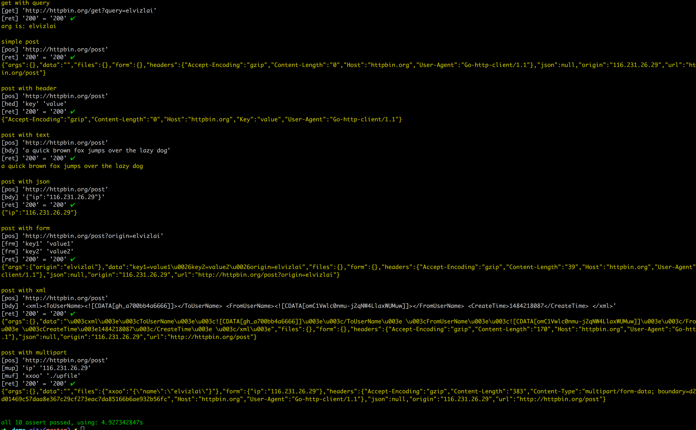

# wotest

#### go语言构建的DSL测试库，用于构建Http测试与断言。所有语句在后缀为.wt的文本文件中撰写。编码采用UTF-8

基础语法：

所有语法关键词均为小写字母。

```
set [name var]: 设置全局变量
$var: 取出全局变量。注意：$header,$body,$resp相关的前缀为保留前缀，请勿占用
env [name]: 读取系统环境变量

echo [var]: 输出，一般用户调试

get [url]: 构建GET请求
post [url]: 构建POST请求
header [key value]: 配置请求Header
json [var]: 配置请求Body
ret [code]: 发起请求，并校验http status code。其中，code为空则不做校验

match: [a b]: 校验a是否等于b
contains [a b]: 校验a中时候含有b
```

如果一个参数中含有空格，请使用双引号'"'包裹，例如："Bearer xxxxxx"

如果需要命令嵌套，请使用'\`'包裹，例如：echo \`env GOPATH\`，读取系统环境变量，并输出

用例请参见`demo.wt`

